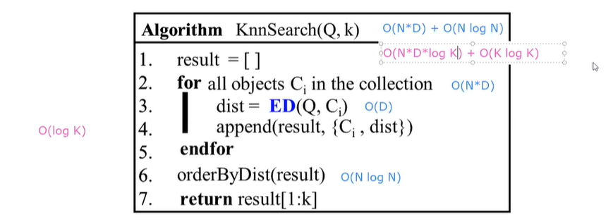

# Base de datos multimedia  
Imagenes, videos, textos  

Obejtivo: Permita hacer consultas centrandonos en un contenido  

Podemos tener en cuenta la busqueda en obejtos 3D  

## Convertir Funcion Distancia a Similitud  

LA similitud y la distancia son directamente proporcionales  

## Propiedades de la distancia  

## Ejemplos de distancias  

   
D: Dimension del espacio vectorial  
En caso de caras: D = 128  

### Distancias cuadraticas  
Arrojan una mejor prescición en los resultados, es la mejor forma de comparar dos objetos.  

## BUSQUEDAS  

### BUSQUEDA KNN  
  

VENTAJA: 
- Si o si retorna datos, aunque esta lejos sigue estando con el más cercano.  
- Retorna ordenado, es el mas usado  

DESVENTAJA:  
- Que puede cojer un vecino que esta muy lejano, ya que seria el mas cercano para el.(La Respuesta se aleja de la query)  

### BUSQUEDA RANGO  
  

VENTAJA:  
-   permite recuperar eficientemente los elementos más cercanos a un punto de consulta dentro de un rango especificado  

DESVENTAJA:  
- Requiere un radio, y la desventaja es el radio que se le va a pasar.  
SI es radio pequeño, quizas no trae nada, pero si es rango grande te trae mucha data.  

## MEDIR EFICIENCIA  
- Se calcula los tiempos, los indices ayudan a mejorar los tiempos.  
