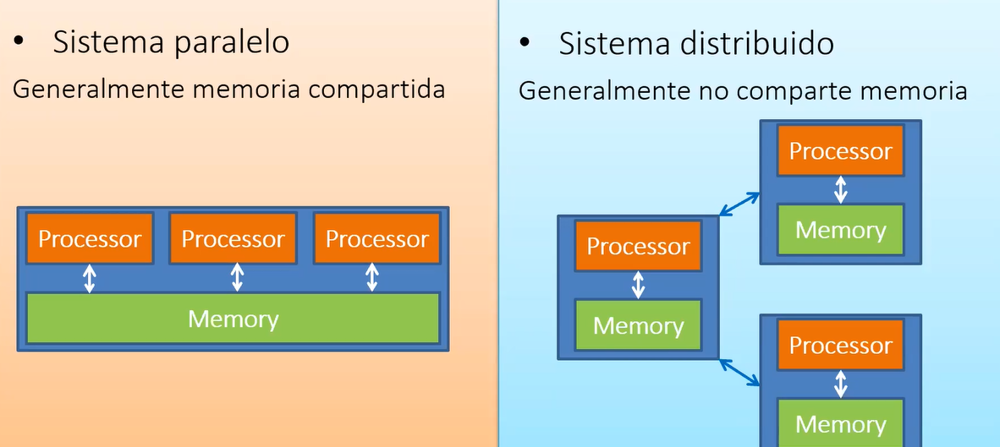
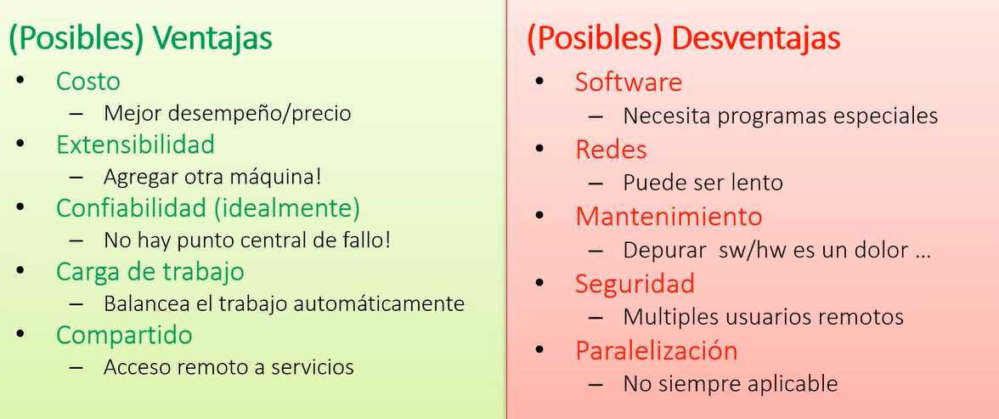
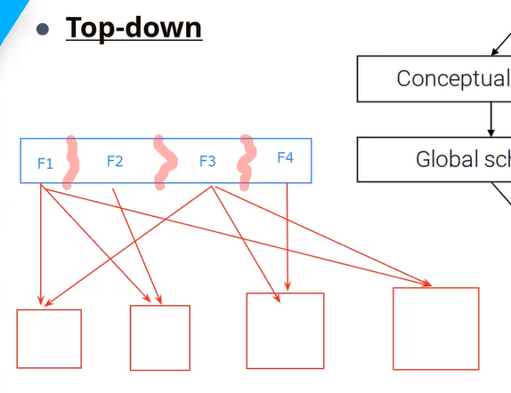
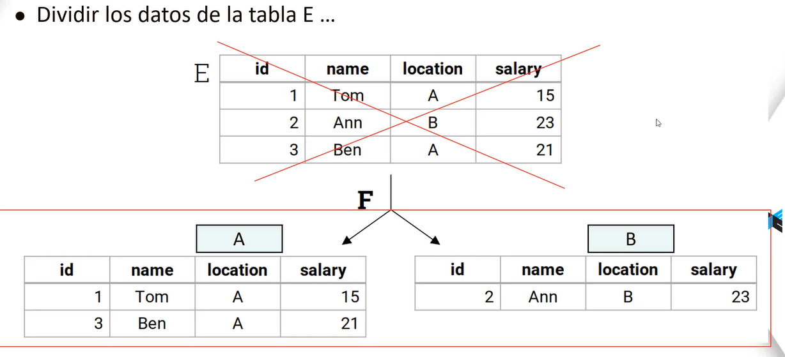

- [SISTEMAS DISTRIBUIDOS](#sistemas-distribuidos)
  - [MONOLITICOS Y DISTRIBUIDOS](#monoliticos-y-distribuidos)
  - [PARAELOS VS DISTRIBUIDOS](#paraelos-vs-distribuidos)
- [DES - VENTAJAS](#des---ventajas)
- [BUEN SISTEMA](#buen-sistema)
- [TOP-DOWN](#top-down)
- [FRAGMENTACION EJEMPLO](#fragmentacion-ejemplo)
  - [FRAGMENTACION HORIZONTAL](#fragmentacion-horizontal)
    - [ROUND ROBIN](#round-robin)
    - [HASH (ATRIBUTOS DISCRETOS)](#hash-atributos-discretos)
    - [RANGE (DISCRETOS, CONTINUOS)](#range-discretos-continuos)
    - [LIST (CATEGORICOS)](#list-categoricos)

# SISTEMAS DISTRIBUIDOS  
- Se usa cuando tenemos un movimiento excesivo de datos, y una computadora no es sufciente.  
- Distribuir los accesos  
- Sn vairas base de datos vinculadas y situadas en varios nodos  
- GESTOR: Software que gestiona todas estas base de datos  

## MONOLITICOS Y DISTRIBUIDOS  
MOno: Una maquina que es n veces mas poderosa  

Distribuidos: Varias maquinas con la misma caracteristica n  

## PARAELOS VS DISTRIBUIDOS  
Distribuido:  
- El desafio es realizar la comunicacion entre computador  

  

# DES - VENTAJAS  
  
- Apapatarse rapidamente  
- El sistema distribuido debe continuar aunque caiga el servidor  

- Es caro  
- Dependemos de la saturacion de la red  
- Al abrir puertos(en caso de la red) se debe mantener seguro la comunicacion  

# BUEN SISTEMA   

TRANSPARENCIA: Para el usuario debe ser transparente la busqueda   
FLEXIVILIDAD: El sistema no debe parar, debe ser flexible para extenderse al nuevo fallo  
CONFIABILIDAD: El usuario no debe sentir que fallo, el sistema debe seguir trabajando en casos de fallo  
DESEMPEÑO: Mas computadoras deben hacer mejor el trabajo que una sola computadora  
ESCABILIDAD: El sistema debe crecer, a nivel de vinculos etc..  

# TOP-DOWN  
  
Se realiza distribucion del mismo dato en distintas nodos, cosa que si cae uno de ellos la informacion no se pierde, sino solo se buscaria en los nodos cercanos.  

DESVENTAJA:  
- Al insertar, se tiene que actualizar en todos los nodos  

# FRAGMENTACION EJEMPLO  
  

## FRAGMENTACION HORIZONTAL  

### ROUND ROBIN  

### HASH (ATRIBUTOS DISCRETOS)  

### RANGE (DISCRETOS, CONTINUOS)  

### LIST (CATEGORICOS)  

