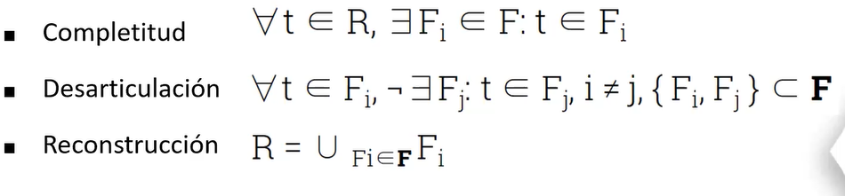
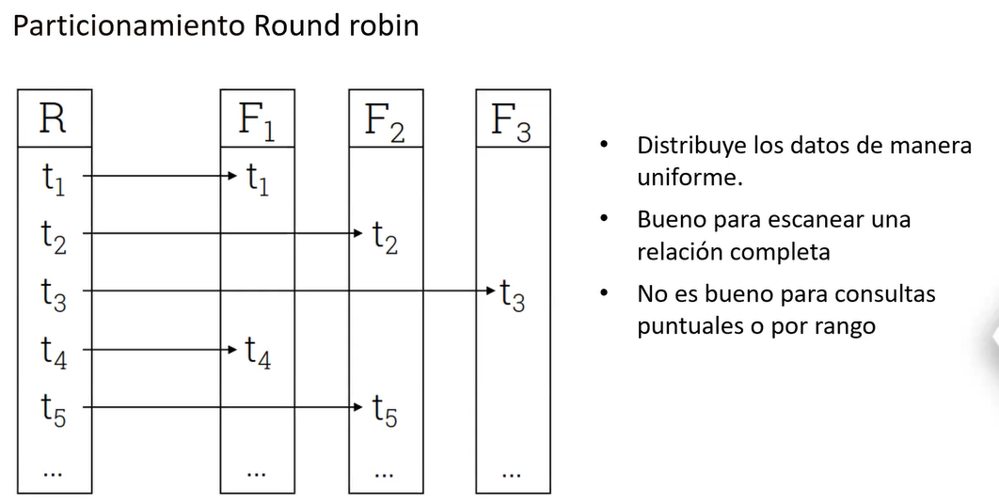
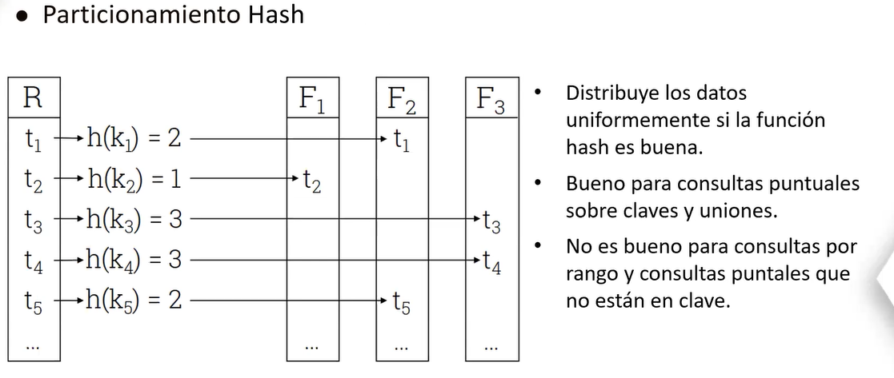
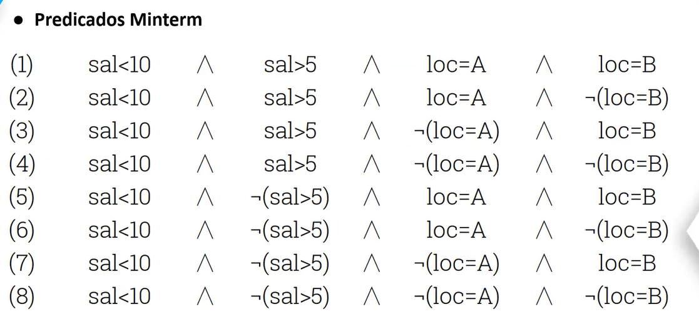
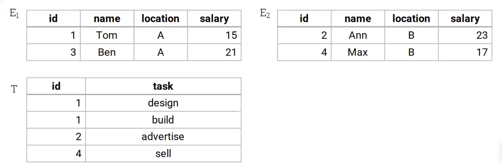
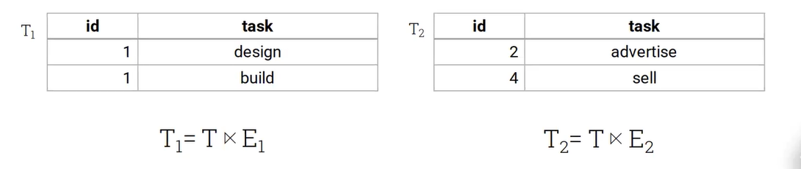
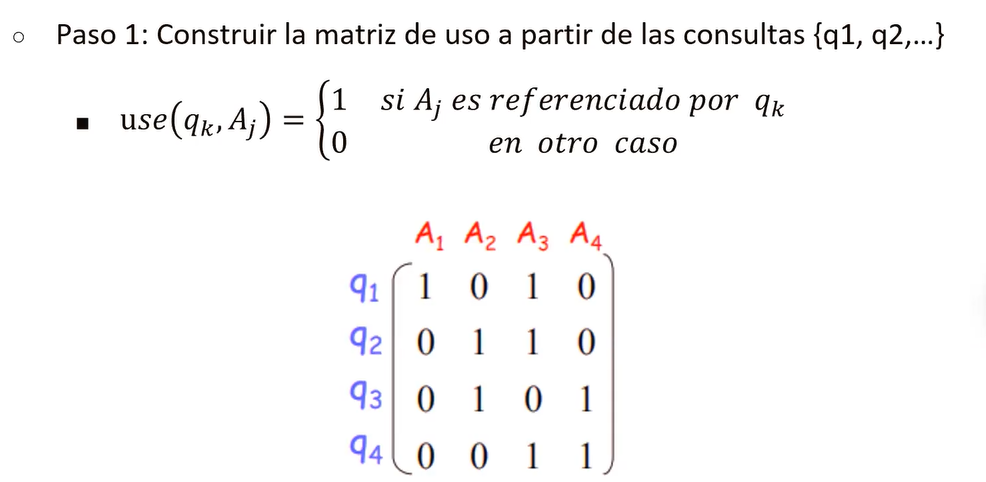
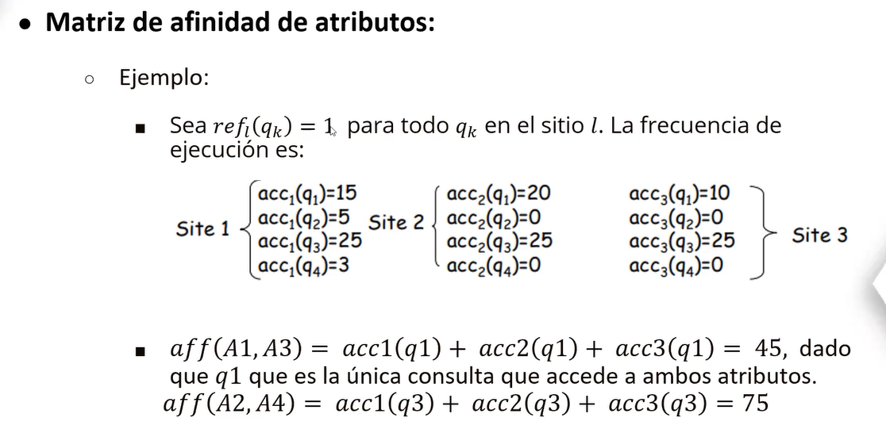
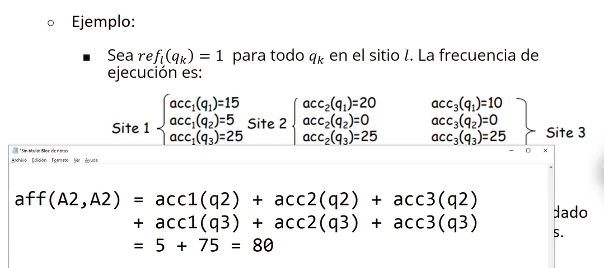

- [SISTEMAS DISTRIBUIDOS](#sistemas-distribuidos)
  - [MONOLITICOS Y DISTRIBUIDOS](#monoliticos-y-distribuidos)
  - [PARAELOS VS DISTRIBUIDOS](#paraelos-vs-distribuidos)
- [DES - VENTAJAS](#des---ventajas)
- [BUEN SISTEMA](#buen-sistema)
- [TOP-DOWN](#top-down)
- [FRAGMENTACION EJEMPLO](#fragmentacion-ejemplo)
  - [FRAGMENTACION HORIZONTAL](#fragmentacion-horizontal)
    - [ROUND ROBIN](#round-robin)
    - [HASH (ATRIBUTOS DISCRETOS)](#hash-atributos-discretos)
    - [RANGE (DISCRETOS, CONTINUOS)](#range-discretos-continuos)
  - [BUENA FRAGMENTACION](#buena-fragmentacion)
    - [MINTERM](#minterm)
    - [FRAGMENTACION DERIVADA](#fragmentacion-derivada)
  - [FRAGMENTACION VERTICAL](#fragmentacion-vertical)
    - [MATRIZ DE USO](#matriz-de-uso)
    - [MATRIX DE AFINIDAD](#matrix-de-afinidad)

# SISTEMAS DISTRIBUIDOS  
- Se usa cuando tenemos un movimiento excesivo de datos, y una computadora no es sufciente.  
- Distribuir los accesos  
- Sn vairas base de datos vinculadas y situadas en varios nodos  
- GESTOR: Software que gestiona todas estas base de datos  

## MONOLITICOS Y DISTRIBUIDOS  
MOno: Una maquina que es n veces mas poderosa  

Distribuidos: Varias maquinas con la misma caracteristica n  

## PARAELOS VS DISTRIBUIDOS  
Distribuido:  
- El desafio es realizar la comunicacion entre computador  

  

# DES - VENTAJAS  
  
- Apapatarse rapidamente  
- El sistema distribuido debe continuar aunque caiga el servidor  

- Es caro  
- Dependemos de la saturacion de la red  
- Al abrir puertos(en caso de la red) se debe mantener seguro la comunicacion  

# BUEN SISTEMA   

TRANSPARENCIA: Para el usuario debe ser transparente la busqueda   
FLEXIVILIDAD: El sistema no debe parar, debe ser flexible para extenderse al nuevo fallo  
CONFIABILIDAD: El usuario no debe sentir que fallo, el sistema debe seguir trabajando en casos de fallo  
DESEMPEÑO: Mas computadoras deben hacer mejor el trabajo que una sola computadora  
ESCABILIDAD: El sistema debe crecer, a nivel de vinculos etc..  

# TOP-DOWN  
  
Se realiza distribucion del mismo dato en distintas nodos, cosa que si cae uno de ellos la informacion no se pierde, sino solo se buscaria en los nodos cercanos.  

DESVENTAJA:  
- Al insertar, se tiene que actualizar en todos los nodos  

# FRAGMENTACION EJEMPLO  
  
Lo que se espera es:  
  

COMPLETITUD: Toda tupla que pertenece a una tabla si o si debe existir un fragmento que lo contenga.  
    - EJM, si un valor de id no esta en ninguna tabla distribuida  

DESARTICULACION: Si una tupla pertenece a otro fragmento, no debe exisitir otro fragmento que lo contegna  
    - EJM, al momento de fragmentar el ID aparece en T1, T2. Se esta duplicando  
  
RECONSTRUCCION: Evitar que haya problemas  

## FRAGMENTACION HORIZONTAL  

### ROUND ROBIN  
  

### HASH (ATRIBUTOS DISCRETOS)  
  

- Depende de uno de los datos y de la funcion hash para distribuir equitativamente  
- Un fragmento puede tener mas tuplas que otros  
- Falla en RAM, si le aplicamos una busqueda entre un rango de fechas(ejemplo)  
- Beneficia en la consulta por igualdad  
- 

### RANGE (DISCRETOS, CONTINUOS)  

- F1: Tuplas con una condicion, de manera similar con las demas tuplas  
- Depende del vector del particionamiente (Estos rangos tienen que ser equitativos, en caso no lo sea habra problemas de traer mucha informacion o  quizas poca)  
- 

## BUENA FRAGMENTACION  

### MINTERM  

### FRAGMENTACION DERIVADA  
  
RESULT:  

## FRAGMENTACION VERTICAL  
### MATRIZ DE USO  
  

En la matriz, para cada query que atributo de la tabla esta usando  
Query 1: Usa el atributo 1 y el 3 etcc   

### MATRIX DE AFINIDAD  
Matriz cuadrada en funcion de sus atributos, en cada celda se aplican unos calculos  
  
  

