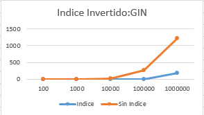
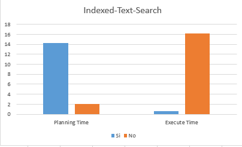
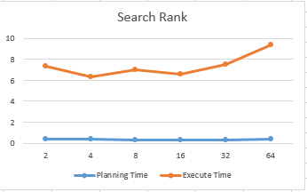
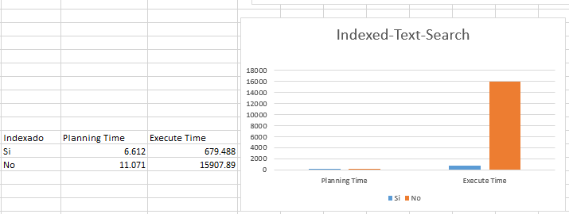
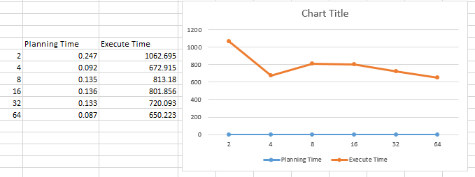

# Laboratorio 8.2  

- Objetivo  
Prueba de las técnicas de indexación de textos en PostgreSQL (full-text search index).  

## P1: Sequential Scan vs GIN  

### Código:  

```sql
-- (1) Creación de la tabla con dos atributos textuales, uno sin indexar y el otro indexado. 
    CREATE EXTENSION pg_trgm

    CREATE TABLE articles (
        body text,
        body_indexed text
    );

-- Create Index
    CREATE INDEX articles_search_idx ON articles USING gin (body_indexed gin_trgm_ops);

-- (2) Inserción de datos aleatorios
    INSERT INTO articles SELECT md5(random()::text), md5(random()::text) from ( SELECT * FROM generate_series(1,100000) AS id) AS x;

-- (3) Consultas
-- Consulta: Sin indexar
    EXPLAIN ANALYZE SELECT count(*) FROM articles WHERE body ILIKE '%abc%';

-- Consulta: Indexado
    EXPLAIN ANALYZE SELECT count(*) FROM articles WHERE body_indexed ILIKE '%abc%';

-- Eliminación la data para la nueva prueba de una nueva cantidad de datos
    DELETE FROM articles;
```  

### Resultados:  

<p align="center">
    
</p>

### Conclusión:  

- RENDIMIENTO:  
    - El uso del índice mejora significativamente el rendimiento de las consultas en comparación con el Sequential Scan en el atributo "body" sin indexar. El tiempo de ejecución de las consultas utilizando el índice es considerablemente menor en la mayoría de los casos.  

- ESCALABILIDAD:  
    - A medida que aumenta la cantidad de datos en la tabla "articles". La diferencia entre el uso del Sequential Scan vs GIN es mas notable. Se puede ver que cuando la tabla alcanza los 100,000 registros y más, el tiempo de ejecución del Sequential Scan aumenta considerablemente, mientras que el uso del GIN se mantiene relativamente estable.  


## P2. Full-text search on Films  
### Código:  

```sql
-- (1) Una vez la restauración de base de datos completada:
-- Ver el vector de pesos de los términos
SELECT 
  setweight(to_tsvector('english', title), 'A') || setweight(to_tsvector('english', description), 'B')
    FROM film;


ALTER TABLE film ADD column indexado tsvector;

-- (2) Creacion de un nuevo atributo indexado Entre titulo & Descripción  
UPDATE  film SET indexado = T.indexado FROM (
  SELECT film_id,
   setweight(to_tsvector('english', title), 'A')   ||
   setweight(to_tsvector('english', description), 'B')
  AS indexado FROM film ) AS T WHERE film.film_id = T.film_id;


CREATE INDEX indexado_gin_idx on film USING gin(indexado);
-- 5.056 ms  Sin indexar
explain analyze
SELECT title, description FROM film
  WHERE description ilike '%man%' or description ilike '%woman%';

-- 0.376 ms Indexado
explain analyze
SELECT title, description FROM film
 WHERE to_tsquery('english', 'Man | Woman') @@ indexado;

-- Query por top k
explain analyze
SELECT title, description, 
       ts_rank_cd(indexado, query) AS rank
 FROM film, to_tsquery('english', 'Man | Woman') query 
 ORDER BY rank desc
 LIMIT 64;--2,4,8,16,32,64
```  

### Resultado 1:  
- Calculo Indexado vs No Indexado  
<p align="center">
    
</p>  
CONCLUSIÓN:  

- RENDIMIENTO: De igual manera que el ítem anterior la cantidad de tiempo es menor respecto al Sequential Scan.

- Planning Time: En los resultados obtenidos se observa que el "Planning Time" es mayor cuando se utiliza el índice GIN en comparación al Sequential Scan. Esto puede deberse a la necesidad de evaluar diferentes opciones de planificación al utilizar el índice.

- Execute Time: En los resultados proporcionados, se observa que el Execute Time es considerablemente menor cuando se utiliza el índice GIN en comparación al Sequential Scan. Esto indica que el índice acelera la recuperación de los registros relevantes y reduce el tiempo total de ejecución de la consulta.

### Resultado 2:  
- Calculo por Rangos  
<p align="center">
    
</p>  

CONCLUSIÓN:  

ESCALABILIDAD: De acuerdo a los resultados obtenidos, se puede observar que a medida que aumenta la cantidad de rankings por los que se realiza la búsqueda, tanto el tiempo de planificación como el tiempo de ejecución de la consulta tienden a disminuir. Esto sugiere que el rendimiento mejora a medida que se incrementa la cantidad de rankings considerados en la búsqueda.

Planning Time: En los resultados obtenidos se observa que el "Planning Time" disminuye ligeramente a medida que aumenta la cantidad de rankings. Esto puede ser debido a que el planificador optimiza mejor la consulta al considerar más opciones de rankings.

Execute Time: El Execute Time se refiere al tiempo real de ejecución de la consulta, una vez que se ha planificado. En los resultados proporcionados, se observa que el "Execute Time" se mantiene relativamente estable a medida que aumenta la cantidad de rankings considerados. Esto indica que, aunque el tiempo de ejecución no disminuye significativamente, tampoco aumenta drásticamente a medida que se agregan más rankings.

## P3. Full-text search on Films  
### Código:  
```sql
CREATE TABLE prueba_3 (
    id INT,
	idBook INT,
    title TEXT,
    publication TEXT,
    author TEXT,
    date DATE,
    year NUMERIC,
    month NUMERIC,
    url TEXT,
    content TEXT
);


-- Comandos para la importación 
command " "\\copy public.prueba_3 (id, idbook, title, publication, author, date, year, month, url, content) FROM 'C:/Users/ObregonW/Desktop/UTEC/BASE-D~1/Labs/LAB82_~1/p3/ARTICL~1.CSV' DELIMITER ',' CSV HEADER QUOTE '\"' ESCAPE '\"';""

-- Creacion del indice invertido
SELECT 
  setweight(to_tsvector('english', title), 'A') || setweight(to_tsvector('english', content), 'B')
    FROM prueba_3;

ALTER TABLE prueba_3 ADD column indexado tsvector;

UPDATE  prueba_3 SET indexado = T.indexado FROM (
  SELECT idBook,
   setweight(to_tsvector('english', title), 'A')   ||
   setweight(to_tsvector('english', content), 'B')
  AS indexado FROM prueba_3 ) AS T WHERE prueba_3.idBook = T.idBook;


CREATE INDEX indexado_gin_idx on prueba_3 USING gin(indexado);

-- Sin indexar
explain analyze
SELECT title, content FROM prueba_3
  WHERE content ilike '%man%' or content ilike '%woman%';
-- Indexado
explain analyze
SELECT title, content FROM prueba_3
 WHERE to_tsquery('english', 'Man | Woman') @@ indexado;
  

-- Query por top k
explain analyze
SELECT title, content, 
       ts_rank_cd(indexado, query) AS rank
 FROM prueba_3, to_tsquery('english', 'Man | Woman') query 
 ORDER BY rank desc
 LIMIT 64;--2,4,8,16,32,64

```  
### Resultado 1:  
- Calculo Indexado vs No Indexado  
<p align="center">
    
</p>  
CONCLUSIÓN:  

- Rendimiento del índice: De igual manera que el ítem anterior la cantidad de tiempo es menor respecto al Sequential Scan, aunque se este trabanjando con una gran cantidad de datos.

- Planning Time: En los resultados obtenidos, se observa que el Planning Time es menor cuando se utiliza el índice GIN en comparación con el Sequential Scan. Esto indica que el proceso de planificación es más eficiente cuando se utiliza un índice.

- Execute Time: En los resultados obtenidos, se observa que el Execute Time es considerablemente menor cuando se utiliza el índice GIN en comparación con el Sequential Scan. Esto indica que el índice acelera la recuperación de los registros relevantes y reduce significativamente el tiempo total de ejecución de la consulta.

### Resultado 2:  
- Calculo por Rangos  
<p align="center">
    
</p>  

CONCLUSIÓN:  

- Escalabilidad y tiempo de ejecución: A medida que aumenta la cantidad de rankings por los que se realiza la búsqueda en una gran cantidad de datos, el tiempo de ejecución de la consulta se mantiene relativamente estable. Aunque hay variaciones en el tiempo de ejecución entre diferentes cantidades de rankings, no se observa una mejora significativa en términos de tiempo de ejecución a medida que se aumenta la cantidad de rankings.

- Planning Time: En los resultados obtenidos, se observa que el Planning Time no varía drásticamente a medida que se aumenta la cantidad de rankings. Esto indica que el tiempo de planificación se mantiene relativamente estable independientemente de la cantidad de rankings considerados.